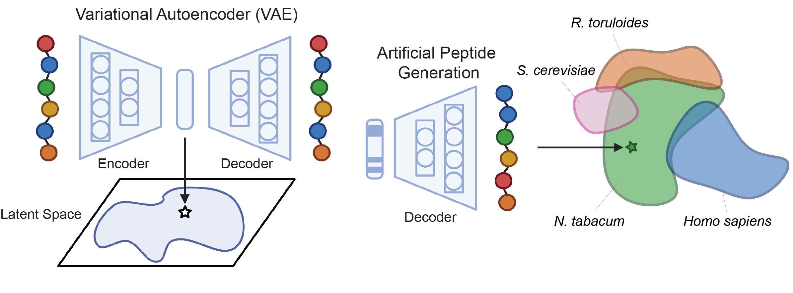

# MTS-VAE
### THE PAPER!
This repository accompanies the work ["Design of diverse, functional mitochondrial targeting sequences across eukaryotic organisms using Variational Autoencoders"](https://www.google.com). This work utilizes local software packages of [TargetP 2.0](https://services.healthtech.dtu.dk/services/TargetP-2.0/) and [DeepLoc 2.0](https://services.healthtech.dtu.dk/services/DeepLoc-2.0/) for synthetic data generation and analysis of artificial peptides, respectively. It also employs [s4pred](https://github.com/psipred/s4pred) and [modlamp](https://modlamp.org) for analyzing the characteristics of generated peptides, while [UniRep](https://github.com/churchlab/UniRep) embeddings are used for sampling. 

Datasets curated for training the VAE models and analysis are made available on Zenodo: https://zenodo.org/records/13214860. Upload the data folders in MTS and Dual directories to run the provided scripts.

### Model:


Install the requirements using: 
```
conda env create -f environment.yml
conda activate mtsvae
```

Note: This setup was tested in a Linux environment. For smooth installation and best results, we recommend using Miniconda on Linux (https://docs.anaconda.com/miniconda/).

For model training, run:
```
python MTS/scripts/train.py
```

To generate artificial mitochondrial targeting sequences, run:
```
python MTS/scripts/generate.py
```

To sample artificial MTS near the cluster center (Note: For new VAE-generated MTSs, you need to update the fasta file for artificial sequences on line 97 and obtain UniRep embeddings (.npz) files):
```
python MTS/scripts/sample.py
```

To train the Dual-VAE model, run:
```
python Dual/scripts/train.py
```

To generate dual targeting sequences using latent interpolation, run:
```
python Dual/scripts/interpolate.py
```

Replicate the analysis/data processing performed in the paper using:
```
python MTS/analysis/distribution.py
python MTS/analysis/seq_identity.py
python MTS/analysis/deeploc2.py
python MTS/analysis/characteristics.py
python MTS/analysis/organism.py


python Dual/analysis/preprocess.py
python Dual/analysis/split.py
python Dual/analysis/deeploc2.py
python Dual/analysis/characteristics.py
```

### Reference
<details>
<summary>If you using these scripts, please cite us:</summary>

```bibtex
Boob, Aashutosh Girish, et al. "Design of diverse, functional mitochondrial targeting sequences across eukaryotic organisms using variational autoencoder." bioRxiv (2024): 2024-08.
```
</details>